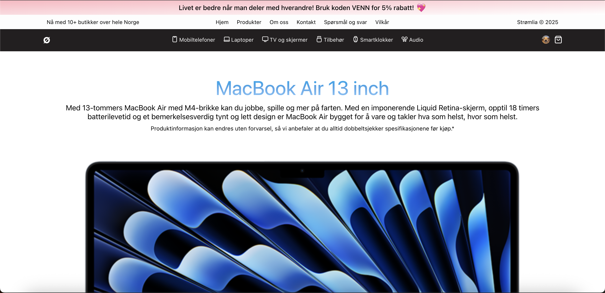

# Strømlia™ - Kraft til det digitale livet

Strømlia™ er en norsk nettbutikk som spesialiserer seg på Apple-produkter og annet førsteklasses elektronisk utstyr. Bygget med fokus på ytelse, brukervennlighet og moderne teknologi, gir Strømlia en sømløs handleopplevelse for teknologientusiaster i Norge.

## Om prosjektet
Strømlia er et personlig prosjekt utviklet av meg, <a href="https://wesseldalen.eu/">wesselvandalen</a>, for å demonstrere mine ferdigheter innen både frontend- og backend-utvikling. Målet med dette prosjektet er ikke bare å lage en funksjonell nettbutikk, men også å vise min kompetanse som full-stack utvikler. Dette er en del av min ambisjon om å flytte til Norge og arbeide som utvikler der.

## Teknologi
Strømlia er utvikler med et moderne teknologistack, som jeg personlig liker, har veldig mye erfaring med, og som er svært etterspurt på markedet:

- **Frontend:** React med Javascript for en dynamisk og responsiv brukeropplevelse
- **Backend:** Java Spring Boot for skalerbar og effektiv håndtering av data
- **Database:** PostgreSQL for sikker og stabil lagring av produkt- og brukerdata
- **Autentisering:** JWT-basert sikkerhet for trygg innlogging og betalingsprosesser

## Funksjoner
Strømlia er mer enn bare en nettbutikk – her er noen av de viktigste funksjonene:

- **Handlekurven** – Legg til, fjern, øk/fjern antall i handlekurven
- **Bestilling** – Legg inn en personlig bestilling med varer som du har lagt til i handlekurven.
- **Produktanmeldelser** – Se hva andre mener før du kjøper

## Videre utvikling
Strømlia er et aktivt prosjekt, og følgende funksjoner er under utvikling:
- **Bedre frakt- og sporingsalternativer**
- **Kontoer og informasjon**

## Kontakt
Har du spørsmål, forslag eller vil du bare ha en pratt om prosjektet? Ta kontakt via:
- **E-post:** wesselvandalen@gmail.com
- **LinkedIn:** <a href="https://linkedin.com/in/wesselvandalen">wesselvandalen</a>

---

© 2025 Strømlia™ - Alle rettigheter reservert.
